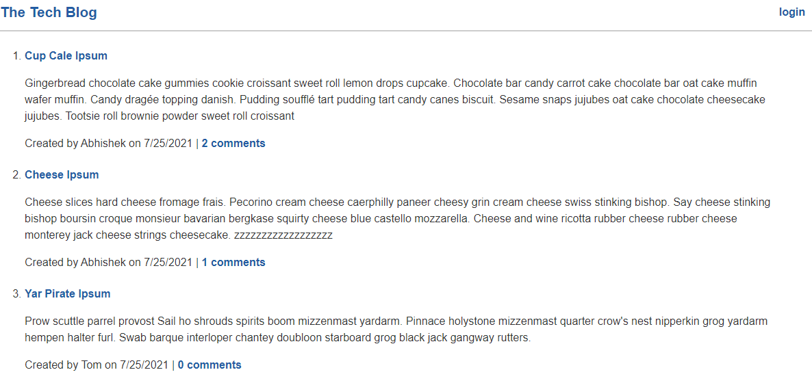

# The Tech Blog
## Version 1.0
## Description
A simple blog site where users can register and create posts. Once registered, user gets access to dashboard where they can create new blog posts or edit and delete their previous posts. Registered users also have the option to comment on existing blog posts.

## Table of Contents
* [License](#license)
* [Installation](#installation)
* [Test](#test)
* [Usage](#usage)
* [Feature](#feature)
* [Credits](#credits)

## License

## Installation
No installation required.

[Link to the deployed app](https://pure-eyrie-01841.herokuapp.com/)

## Test
Testing is available for the helper functions.

>npm test

## Usage
* The homepage shows the title of all existing blog posts and a preview of the post content.
* It also displays the name of the user who created the post, date on which it was created and number of comments.

* To add comments or get access to the dashboard and create new posts, users are required to login.
* To login, click on the login button and enter your _username_ and _password_.
* If you don't have an account, click signup and enter username, password and email address.

* Once logged in, user can access dash board to create new posts and edit or delete existing ones.
* User also has the option to add comments on blog posts.

## Feature
* Blog post preview on homepage
* Line breaks are preserved when adding new posts, editing and displaying.
* Cookie max age 5 mins. User required to login again once it expires.
* Dashboard and comments feature only available to users logged in

## Credits
#### NPM Modules
* [bcrypt](https://www.npmjs.com/package/bcrypt)
* [connect-session-sequelize](https://www.npmjs.com/package/connect-session-sequelize)
* [dotenv](https://www.npmjs.com/package/dotenv)
* [express](https://www.npmjs.com/package/express)
* [express-handlebars](https://www.npmjs.com/package/express-handlebars)
* [express-session](https://www.npmjs.com/package/express-session)
* [mysql2](https://www.npmjs.com/package/mysql2)
* [sequelize](https://www.npmjs.com/package/sequelize)
* [jest](https://jestjs.io/)

#### Users
* Abhishek Jamwal - [GitHub](https://github.com/jamwalab)